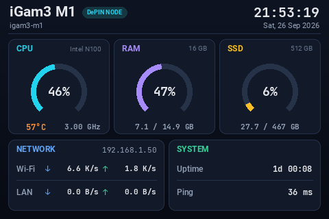
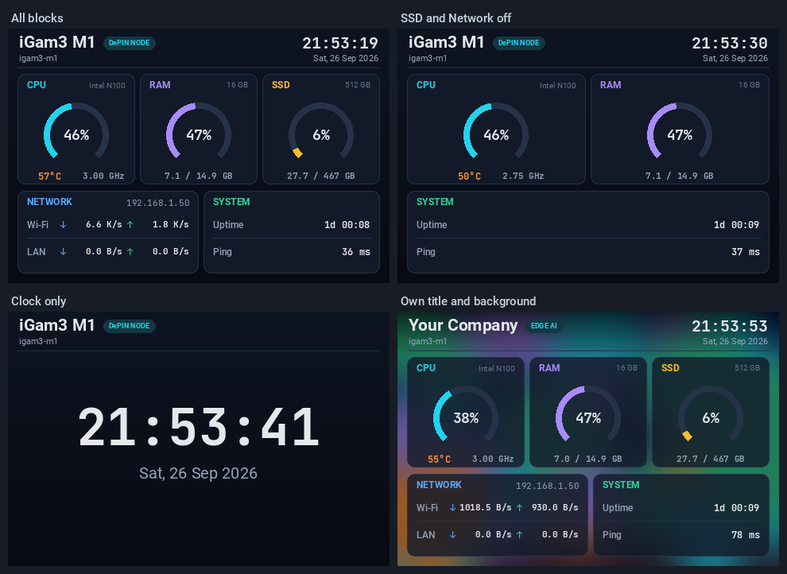
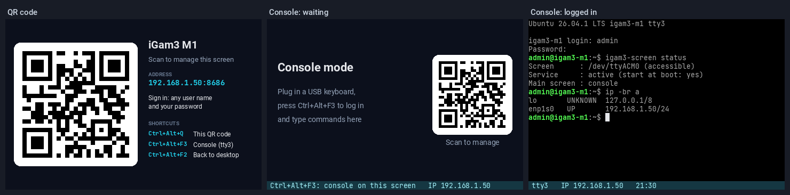
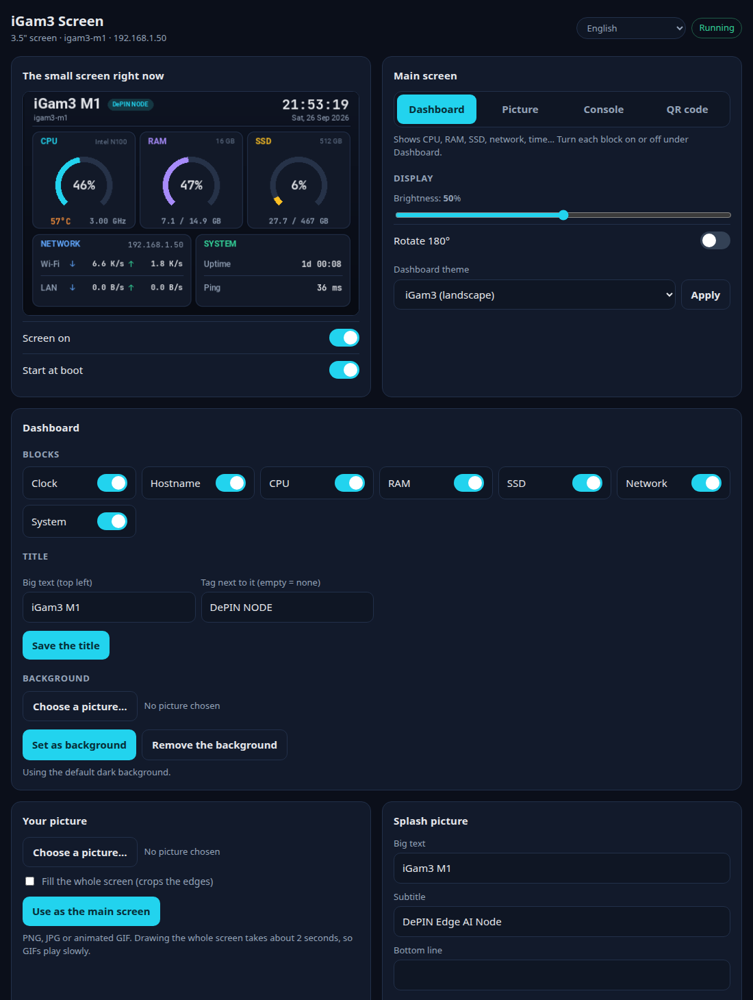
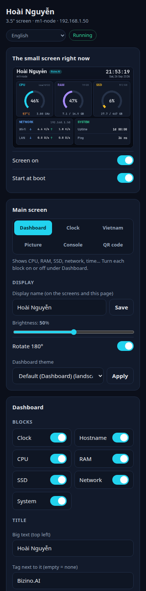
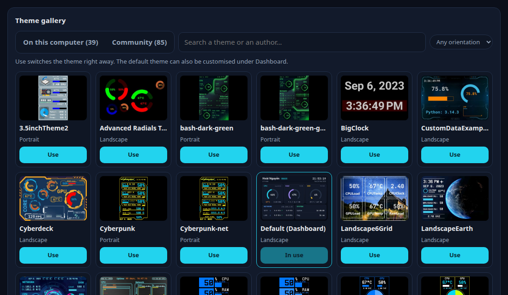
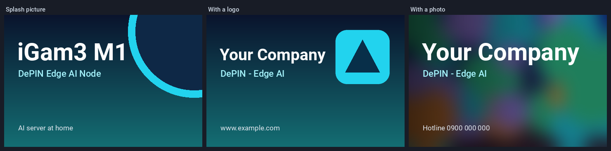
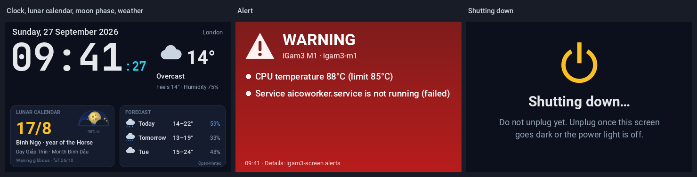
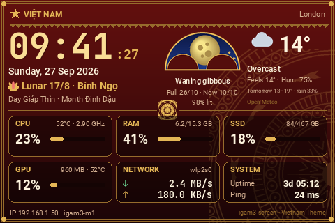
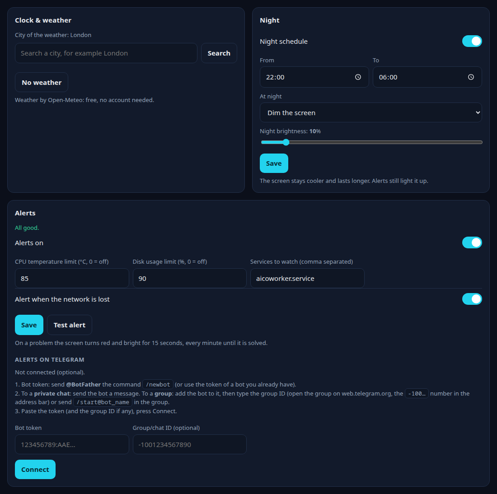

# igam3-screen

**English** · [Tiếng Việt](README.vi.md)

Manager for the **3.5" screen built into the iGam3 M1** (DePIN / Edge AI node) on **Ubuntu**, with an experimental
**Windows** version: system dashboard, fixed picture, QR code or text console, plus a web control panel that also works
from a phone.

<p align="center"></p>

The screen maker's own app (TURZX) only exists for Windows. This project drives the screen on Linux with the open source
[turing-smart-screen-python](https://github.com/mathoudebine/turing-smart-screen-python) library, and adds a theme,
management tools and installers made for the iGam3.

## Features

- **Dashboard**: CPU (%, temperature, clock speed), RAM, SSD, Wi-Fi/LAN speed, IP address, uptime, ping, date and time.
  **Turn each block on or off** and the layout rearranges itself; change the **title**, **tag** and **background
  picture**; 38 other 3.5" themes are included.
- **Theme gallery**: the 39 bundled themes, plus **85 community themes** tested on this screen that install with one
  click from their authors' posts.
- **Vietnam Theme**: red lacquer and gold with Đông Sơn bronze drum patterns, solar and lunar calendars, a Swiss-watch
  moon phase, the weather and every value of the computer, with your own small logo.
- **6 kinds of main screen**, kept after a restart: dashboard, clock, Vietnam Theme, fixed picture (PNG/JPG/GIF), QR code,
  text console.
- **Clock screen**: time, date, Vietnamese lunar calendar with its holidays, and the weather of your city (Open-Meteo,
  free, no account).
- **Alerts**: high CPU temperature, disk almost full, network lost or a service stopped: the screen turns red and bright,
  and your Telegram bot gets a message.
- **Night schedule**: the screen dims or turns off at night. A **"Shutting down…"** screen when the computer goes off.
- **Splash pictures**: make a picture with your own text, logo or photo.
- **Web control panel**: see live what the small screen shows, turn it on or off and change everything above. Open it
  to phones on your local network (with a password) when you want to.
- **QR code** on the small screen to open the panel from a phone, and a **Ctrl+Alt+Q** shortcut.
- **Console mode** (Linux): use the computer without an HDMI monitor, with a USB keyboard and the small screen.
- **GPU data of Intel integrated graphics** (Linux) for the themes that show a GPU: load, memory, frequency,
  temperature. turing-smart-screen-python itself only reads NVIDIA and AMD cards.
- **English and Vietnamese**, following the language of the system.
- **One-file installer** for Ubuntu that works without Internet; running it again upgrades and keeps your settings.

<p align="center"></p>
<p align="center"></p>

## Hardware

| | |
|---|---|
| Computer | iGam3 M1 (Intel N100, 16 GB RAM, 512 GB SSD). Other mini PCs with the same screen work too |
| Screen | Turing Smart Screen 3.5" / TURZX "UsbMonitor", USB `1a86:5722`, 320×480, "revision A" |
| System | Ubuntu (tested on Ubuntu 26.04, Python 3.14). Windows 10/11: **experimental** |

Check that the computer has this screen (Ubuntu):

```bash
lsusb -d 1a86:5722
```

A line with `QinHeng Electronics UsbMonitor` means it does.

## Install on Ubuntu

### Option 1: one-file installer (recommended, no Internet needed)

1. Download `igam3-screen-installer-<version>.run` from the
   [Releases](https://github.com/nguyenduchoai/igam3-screen/releases) page.
2. Open a terminal as your **normal user** (do not type `sudo`) and run:
   ```bash
   bash igam3-screen-installer-1.5.0.run
   ```
   You can set the title and the language right away:
   ```bash
   bash igam3-screen-installer-1.5.0.run --title "My node" --tag "DePIN NODE" --lang en
   ```
3. Type your sudo password when asked. About 10 seconds later the small screen shows the dashboard.

The Python libraries bundled in the `.run` file are built for Python 3.14 (Ubuntu 26.04). With another Python version the
installer downloads them from the Internet instead.

### Option 2: from the source code (needs Internet)

```bash
sudo apt install git
git clone https://github.com/nguyenduchoai/igam3-screen.git
bash igam3-screen/install.sh
```

### What the installer does

- Copies the program to `~/igam3-screen` (change it with `--dir`).
- Creates its own Python environment, without touching the system Python.
- Detects the network cards and the hardware (CPU name, RAM, disk) shown on the dashboard.
- Installs the background service, the `igam3-screen` command, the **iGam3 Screen** icon in the application menu and
  the Ctrl+Alt+Q shortcut.
- Runs `setup-root.sh` (needs sudo), which:
  - adds a udev rule so that your account can open the screen, and tells ModemManager not to probe it as a modem;
  - adds your account to the `dialout` and `tty` groups;
  - enables `loginctl enable-linger`, so the screen starts at boot, even before anyone logs in;
  - installs `python3-tk` for the configuration window of turing-smart-screen-python.

Other options: `--skip-root` (skip the sudo step), `--skip-service` (only copy the program and prepare Python), `--help`.

## Install on Windows (experimental)

> The Windows version **has not been tested on a real Windows computer yet**. If something fails, please open an issue
> with the text of the installer window.

1. Download `igam3-screen-windows-<version>.zip` from the
   [Releases](https://github.com/nguyenduchoai/igam3-screen/releases) page and extract it.
2. **Close the TURZX app** if it is running, and remove it from Startup: it holds the COM port of the screen.
3. Double-click **`install-windows.cmd`**.
   - Without Python 3.11 or newer, the installer offers to install Python 3.13 with `winget`. You can also install it
     yourself from [python.org](https://www.python.org/downloads/) (tick *Add python.exe to PATH*).
   - The installer needs the Internet to download the Python libraries.
4. Done: the small screen shows the dashboard. The Start menu has **iGam3 Screen** (the web panel) and an uninstall
   entry. Ctrl+Alt+Q shows the QR code. New terminal windows have the `igam3-screen` command.

Differences with Ubuntu:
- **No console mode.**
- **No CPU temperature**: Windows only gives it to administrator programs.
- **Ping is measured with a TCP connection**, since a real ping needs administrator rights.
- **GPU data only for NVIDIA and AMD cards**, not for Intel integrated graphics.
- The first time the panel is opened to the local network, Windows may ask whether Python may use the network: allow it
  for *Private networks*.

## Usage

### Web panel

Open it with the **iGam3 Screen** icon, or run `igam3-screen panel`, then go to http://localhost:8686.
By default the panel **only opens on the computer itself** and stops after 30 minutes without use.

<p align="center"></p>

### From a phone (local network)

To manage the screen from a phone, for example when no HDMI monitor is connected, turn it on yourself:

```bash
igam3-screen web --password
igam3-screen web --lan on
```

On a phone on the same Wi-Fi, go to `http://<IP of the computer>:8686` (or scan the QR code on the small screen). Any
user name works, the password is the one you just set. Close it with `igam3-screen web --lan off`.

The panel uses plain HTTP: only use it on a home or office network you trust, and never forward port 8686 to the
Internet on your router. The password is stored hashed (PBKDF2) in `web.yaml`, and the panel refuses requests forged by
other web sites.

<p align="center"></p>

### Main screen

| Command | The small screen shows |
|---|---|
| `igam3-screen mode stats` | the dashboard |
| `igam3-screen mode clock` | clock, lunar calendar, moon phase and weather |
| `igam3-screen mode vietnam` | the Vietnam Theme |
| `igam3-screen image picture.png --keep` | a fixed picture (PNG/JPG, animated GIF). `--fill` fills the whole screen |
| `igam3-screen mode qr` | a QR code that opens the web panel |
| `igam3-screen mode console` | the text console tty3 (Linux only) |

`igam3-screen image picture.png` (without `--keep`) only shows the picture for now; `igam3-screen start` goes back to the
main screen. Drawing the whole screen takes about 2 seconds, so animated GIFs play slowly (about 0.5 frame per second).

### Dashboard

```bash
igam3-screen title "My node" "DePIN NODE"   # big text + tag ("" for no tag)
igam3-screen blocks ssd=off network=off     # blocks: clock hostname cpu ram ssd network system
igam3-screen background ~/Pictures/bg.jpg   # background picture; --none removes it
igam3-screen themes                         # 38 other 3.5" themes
igam3-screen theme LandscapeEarth
igam3-screen brightness 50                  # 0-100 (this screen gets hot when very bright)
igam3-screen rotate                         # rotate 180°
```

With every data block off and the clock on, the screen becomes a big clock.

### Theme gallery and community themes

The **Theme gallery** of the web panel shows every theme with a preview: **Use** switches to it right away. Its
**Community** tab lists 85 more themes for the 3.5" screen that people shared in the
[Themes discussions](https://github.com/mathoudebine/turing-smart-screen-python/discussions/categories/themes) of
turing-smart-screen-python, each one tested with igam3-screen: **Get & use** downloads it and shows it.

<p align="center"></p>

From a terminal:

```bash
igam3-screen store                              # list the community themes
igam3-screen store install "DragonBall" --use   # download it from its author's post and show it
igam3-screen store remove "DragonBall"
```

Community themes are **not part of igam3-screen**. `tools/theme_catalog.json` only holds links, checksums and install
instructions, and each theme is downloaded from its author's post when you install it. They belong to their authors,
and some use artwork of games or anime: keep them for your own screen and ask their authors before sharing them further.
Themes that need their author's Python code, or fonts that were never published, are left out.

Good to know:
- GPU fields work with NVIDIA and AMD cards and, on Linux, with Intel integrated graphics like the iGam3 M1's: load
  and memory of the programs that use the GPU, frequency, and the temperature of the chip (integrated graphics have no
  sensor of their own). On Windows, only NVIDIA and AMD cards.
- When a theme shows a single network card (LAN or Wi-Fi), it shows the one that carries the traffic.
- Maintainers refresh the catalog with `python packaging/theme_catalog.py` (reads the discussions, then installs and
  runs every theme in the screen simulator).

### Splash picture

```bash
igam3-screen splash "Your Company" "DePIN node" "www.example.com" --logo ~/Pictures/logo.png --keep
```

Long text shrinks or wraps onto two lines by itself. Add `--photo photo.jpg` for a photo background.
Without `--keep` the picture is only shown for now.

<p align="center"></p>

### Language

The dashboard, the web panel, the commands and the installers are in **English** or **Vietnamese**. By default they
follow the language of the system: Vietnamese on a Vietnamese system, English everywhere else. To choose:

```bash
igam3-screen language en      # or vi, or auto (follow the system)
```

or use the selector at the top of the web panel. The installers take `--lang en|vi` (`-Lang` on Windows).

### Clock, weather and lunar calendar

```bash
igam3-screen weather "London"   # city of the weather (Open-Meteo: free, no account)
igam3-screen mode clock
```

The clock screen shows the time, the date, the Vietnamese lunar date with the names of the day, month and year, the
lunar holidays (Tết, Mid-Autumn…), the phase of the moon in the moonphase window of Swiss watches, the weather now and
a 3-day forecast, refreshed every 15 minutes. Without Internet
it keeps the last forecast. The web panel has the same settings under **Clock & weather**.

<p align="center"></p>

### Vietnam Theme

<p align="center"></p>

A main screen with a Vietnamese soul: red lacquer and gold leaf, the sun and flying Lạc birds of the Đông Sơn bronze
drums, a lotus, the time, the solar date, the lunar date in the traditional way (*17 tháng Tám · Bính Ngọ*) with the
can chi of the day and month and the lunar holidays, the moonphase window of Swiss watches (next full and new moon,
share lit), the weather, and every value of the dashboard: CPU (load, temperature, clock), RAM, SSD, GPU (Intel
integrated graphics too), network, uptime, ping, IP.

```bash
igam3-screen mode vietnam            # or: igam3-screen vietnam
igam3-screen logo my-logo.png        # small logo in the corner, on a cream plate; --none removes it
```

The moon phase comes from the algorithms of Jean Meeus (new and full moons to the minute). The web panel has a
**Vietnam Theme** section with a live preview, the logo and a button to use it.

### Alerts and Telegram

The screen watches the computer every 15 seconds. When something goes wrong it turns **red and bright** for 15 seconds,
then shows the main screen again, and repeats every minute until the problem is solved:

| Alert | Default |
|---|---|
| CPU temperature | from 85°C |
| Disk usage | from 90% |
| No Internet | for 45 seconds |
| A service stopped | none watched: add yours, e.g. `aicoworker.service` (`user:name.service` for a user service) |

```bash
igam3-screen alerts                                   # settings and current alerts
igam3-screen alerts --temp 85 --disk 90 --network on --services aicoworker.service
igam3-screen alerts --test                            # a test alert on the screen (and Telegram)
igam3-screen alerts off                               # or on
```

To get the alerts on your phone, connect a Telegram bot of your own (optional):

1. In Telegram, message **@BotFather**: `/newbot`, choose a name, and copy the bot token it gives (a bot you already
   have works too).
2. To get the alerts in a **private chat**, send any message to the bot. For a **group**, add the bot to the group, then
   either send `/start@your_bot` in the group, or give the group ID (open the group on web.telegram.org: the `-100…`
   number in the address bar).
3. Run `igam3-screen telegram --token` and paste the token, with `--chat <group ID>` for a group (or use the **Alerts**
   section of the web panel, which has a field for the group ID).

The bot then gets a message when an alert starts and when it is over. The token is kept in `telegram.yaml`, readable by
your account only. `igam3-screen telegram --test` sends a test message, `--off` removes the bot.

### Night schedule

```bash
igam3-screen night 22:00-06:00 --dim 10   # dim to 10% at night, or --screen-off to turn it off
igam3-screen night off
```

The screen gets warm and ages faster when bright, so a night schedule helps. Alerts still light it up at night.

<p align="center"></p>

### Shutting down

When the computer shuts down or restarts (Linux), the small screen shows **Shutting down…** or **Restarting…** instead
of going black. Unplug once the screen goes dark or the power light of the computer is off.

### QR code and shortcuts

- **Ctrl+Alt+Q** (or `igam3-screen qr`): shows the QR code for 1 minute, then the main screen again.
  On Ubuntu this shortcut works once you are logged in to the desktop.
- **Ctrl+Alt+F3**: opens the text console tty3, which appears on the small screen in console mode.
  **Ctrl+Alt+F2** goes back to the desktop.

The QR code only works once the panel is open to the local network. It follows IP address changes.

### Without an HDMI monitor (Linux)

The 3.5" screen is a USB device, not an HDMI monitor: it cannot show the desktop, the BIOS or the boot, and it only
lights up once the service runs (10–15 seconds after power on). Two ways to use the computer without a monitor:
- **Console mode**: `igam3-screen mode console`. Plug in a USB keyboard, press Ctrl+Alt+F3, log in and type commands
  on the small screen (60 columns × 19 rows). Its waiting screen has a QR code.
- **The web panel from a phone**, in local network mode.

### Commands

| Command | Does |
|---|---|
| `igam3-screen status` | screen, service and settings |
| `igam3-screen start` / `stop` / `restart` | start / stop / restart the main screen |
| `igam3-screen enable` / `disable` | start at boot on / off (and start / stop now) |
| `igam3-screen panel` | open the web panel |
| `igam3-screen web --password` / `--lan on\|off` | password, open / close the panel to the local network |
| `igam3-screen language en\|vi\|auto` | language |
| `igam3-screen weather "<city>"` | city of the weather on the clock screen |
| `igam3-screen alerts` / `telegram --token` | alerts, Telegram bot |
| `igam3-screen night 22:00-06:00 --dim 10` | night schedule |
| `igam3-screen vietnam` / `logo <picture>` | Vietnam Theme, its logo |
| `igam3-screen themes` / `store` | themes on this computer / community themes to install |
| `igam3-screen test` | orientation test pattern (the arrow must point up) |
| `igam3-screen off` | turn the screen off |
| `igam3-screen config` | configuration window of turing-smart-screen-python |
| `igam3-screen logs -f` | logs |
| `igam3-screen --help` | every command |

Until your next login after installing, the `igam3-screen` command is not in the PATH yet: use `~/igam3-screen/igam3-screen`.

## Upgrade and uninstall

- **Upgrade**: run the installer of the new version. The settings, title, pictures and web password are kept.
- **Uninstall on Ubuntu**: run the command below. The `dialout`/`tty` group membership and linger are left as they are.
  ```bash
  bash ~/igam3-screen/uninstall.sh
  ```
- **Uninstall on Windows**: Start menu > iGam3 Screen > *iGam3 Screen - Uninstall*.

## Troubleshooting

| Problem | What to do |
|---|---|
| The screen stays dark | `igam3-screen status`. If it says "NO PERMISSION", run `sudo ~/igam3-screen/setup-root.sh` and restart the computer |
| Upside down | `igam3-screen rotate` |
| Too dark or too bright | `igam3-screen brightness 50` |
| Screen not found | `lsusb -d 1a86:5722`; reconnect the internal USB cable if there is one, or restart the computer |
| Windows: the screen does not start | close the TURZX app; check Device Manager > Ports (COM & LPT); `igam3-screen logs` |
| The phone cannot connect | same network? `igam3-screen web` tells whether the panel is open; the IP may have changed (see the NETWORK block) |
| A theme leaves some fields empty | the computer does not provide that value (FPS, fan speed, or GPU fields on Windows with Intel graphics) |
| Details of an error | `igam3-screen logs -n 100` |

## Project layout

| Path | Content |
|---|---|
| `app/` | what the 3.5" screen needs from turing-smart-screen-python 3.10.0, the `iGam3` theme, extra data sources in `library/sensors/sensors_custom.py` |
| `app/res/themes/iGam3/make_theme.py` | layout and colours of the iGam3 theme (makes `background.png` and `theme.yaml` from `custom.yaml`) |
| `tools/igam3_screen.py` | the `igam3-screen` command |
| `tools/web_panel.py`, `tools/web/` | the web panel |
| `tools/console_mirror.py`, `tools/qr_screen.py`, `tools/make_splash.py` | console mode, QR screen, splash pictures |
| `tools/i18n.py` | English / Vietnamese |
| `tools/clock_screen.py`, `tools/weather.py`, `tools/lunar.py` | clock screen, Open-Meteo weather, Vietnamese lunar calendar |
| `tools/screen_events.py` | alerts, Telegram, night schedule, shutdown screen |
| `tools/vietnam_screen.py`, `tools/moon.py` | Vietnam Theme, moon phase (Swiss-watch window) |
| `tools/theme_store.py`, `tools/theme_catalog.json` | community themes: installer and catalog (built by `packaging/theme_catalog.py`) |
| `tools/platform_support.py` | what differs between Linux (systemd) and Windows |
| `install.sh`, `setup-root.sh`, `uninstall.sh` | install / permissions / uninstall on Ubuntu |
| `install-windows.cmd`, `install-windows.ps1`, `uninstall-windows.ps1` | install / uninstall on Windows |
| `packaging/` | builds the installers |

Each computer creates these files for itself (not in git): `settings.yaml` (main screen, language, weather, alerts,
night), `web.yaml` (password), `telegram.yaml` (bot), `images/`, `app/config.yaml` (modified),
`app/res/themes/iGam3/custom.yaml`.

## Building a release

On an Ubuntu computer where igam3-screen is installed and works, raise the number in `VERSION` and run:

```bash
bash packaging/build.sh
```

This makes `dist/igam3-screen-installer-<VERSION>.run` (Linux, libraries included) and
`dist/igam3-screen-windows-<VERSION>.zip`. Publish both as a GitHub release, for example with the
[GitHub CLI](https://cli.github.com/): `gh release create v1.5.0 dist/*`.

## License and credits

- Released under **GPL-3.0-or-later** ([LICENSE](LICENSE)), since it uses and ships
  [turing-smart-screen-python](https://github.com/mathoudebine/turing-smart-screen-python) © Matthieu Houdebine and
  contributors.
- Fonts: Roboto / Roboto Mono (Apache-2.0), JetBrains Mono / Generale Mono (SIL OFL-1.1). See [NOTICE](NOTICE).
- Weather data by [Open-Meteo.com](https://open-meteo.com/) (CC BY 4.0), free for non-commercial use. Lunar calendar
  algorithm by Hồ Ngọc Đức; new and full moons after Jean Meeus, "Astronomical Algorithms".
- Community project, **not affiliated** with iG3 / Gam3 Labs or TURZX. These names belong to their owners.
