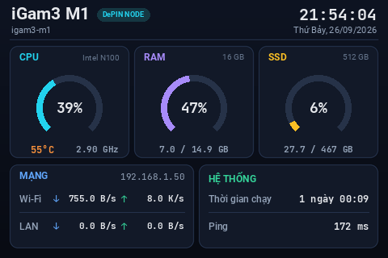
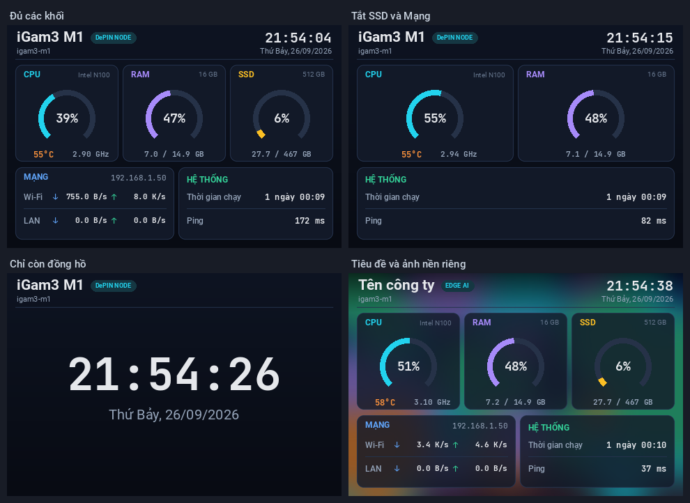
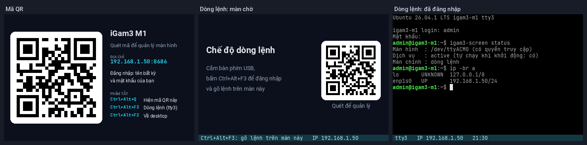
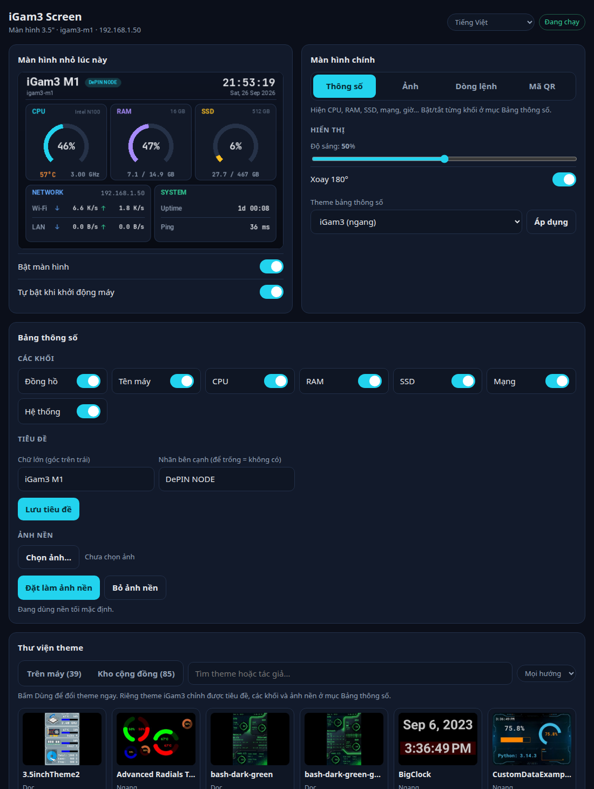
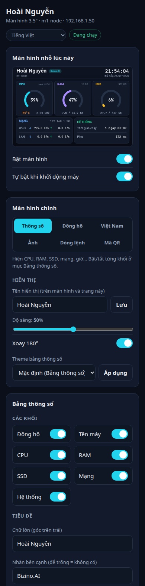
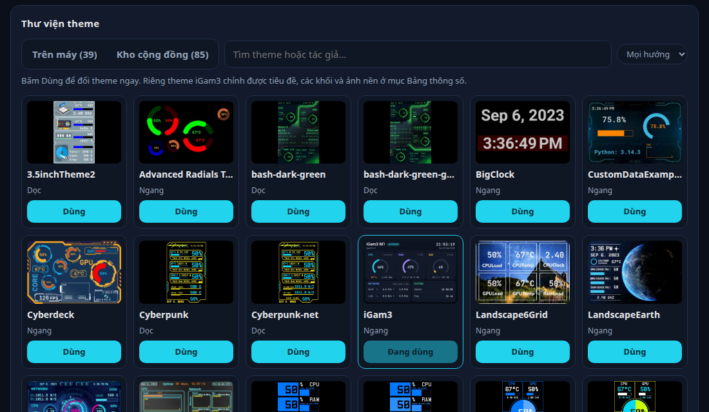
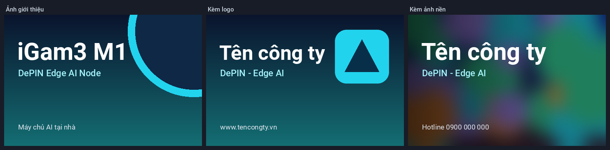
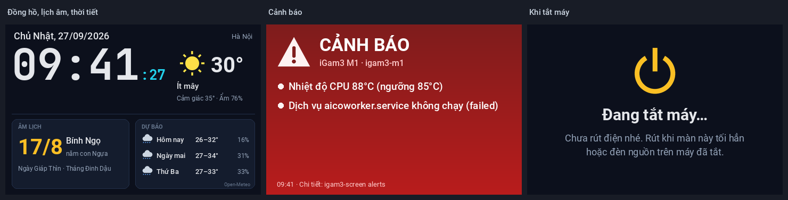
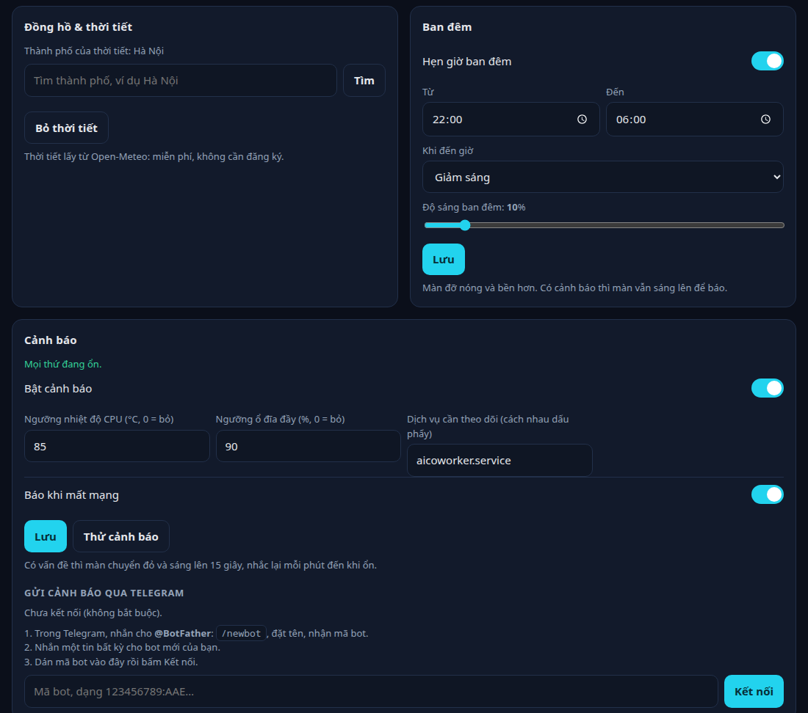

# igam3-screen

[English](README.md) · **Tiếng Việt**

Quản lý **màn hình 3.5" gắn trên máy iGam3 M1** (DePIN / Edge AI node) khi cài **Ubuntu**, và thử nghiệm trên **Windows**:
bảng thông số máy, ảnh cố định, mã QR, dòng lệnh, cùng giao diện quản lý trên trình duyệt (dùng được cả từ điện thoại).

<p align="center"></p>

App gốc của hãng màn hình (TURZX) chỉ có bản Windows. Dự án này dùng thư viện mã nguồn mở
[turing-smart-screen-python](https://github.com/mathoudebine/turing-smart-screen-python) để điều khiển màn trên Linux,
rồi thêm theme, công cụ quản lý và bộ cài riêng cho iGam3.

## Tính năng

- **Bảng thông số**: CPU (%, nhiệt độ, xung), RAM, SSD, tốc độ Wi-Fi/LAN, IP, thời gian chạy, ping, ngày giờ.
  **Bật/tắt từng khối**, bố cục tự dàn lại; đổi **tiêu đề**, **nhãn**, **ảnh nền**; kèm 38 theme 3.5" khác có sẵn.
- **Thư viện theme**: 39 theme có sẵn, cộng **85 theme của cộng đồng** đã chạy thử với màn này, bấm một nút là tải về
  từ bài đăng của tác giả và dùng luôn.
- **5 kiểu màn hình chính**, giữ nguyên sau khi khởi động lại: bảng thông số, đồng hồ, ảnh cố định (PNG/JPG/GIF), mã QR, dòng lệnh.
- **Màn đồng hồ**: giờ, ngày, lịch âm kèm ngày lễ, và thời tiết của thành phố bạn chọn (Open-Meteo, miễn phí, không cần
  đăng ký).
- **Cảnh báo**: CPU quá nóng, ổ gần đầy, mất mạng hoặc dịch vụ bị dừng thì màn chuyển đỏ, tăng sáng, và gửi tin về bot
  Telegram của bạn.
- **Hẹn giờ ban đêm**: màn tự giảm sáng hoặc tắt vào ban đêm. Màn **"Đang tắt máy…"** khi tắt máy.
- **Ảnh giới thiệu**: tạo ảnh có chữ của bạn, kèm logo hoặc ảnh nền.
- **Giao diện quản lý web**: xem trực tiếp màn nhỏ đang hiện gì, bật/tắt, đổi mọi thứ ở trên. Mở cho điện thoại
  trong mạng LAN (có mật khẩu) khi bạn muốn.
- **Mã QR** trên màn nhỏ để mở giao diện từ điện thoại, và phím tắt **Ctrl+Alt+Q**.
- **Chế độ Dòng lệnh** (Linux): dùng máy không cần màn HDMI, cắm bàn phím USB rồi đăng nhập ngay trên màn nhỏ.
- **Số liệu GPU của đồ hoạ Intel onboard** (Linux) cho các theme có ô GPU: tải, bộ nhớ, xung, nhiệt độ. Bản gốc
  turing-smart-screen-python chỉ đọc được card NVIDIA và AMD.
- **Tiếng Việt và tiếng Anh**, tự theo ngôn ngữ của máy.
- **Bộ cài một file** cho Ubuntu, cài được không cần Internet; chạy lại là nâng cấp mà vẫn giữ cấu hình.

<p align="center"></p>
<p align="center"></p>

## Phần cứng

| | |
|---|---|
| Máy | iGam3 M1 (Intel N100, 16 GB RAM, SSD 512 GB). Máy mini PC khác gắn cùng loại màn cũng dùng được |
| Màn hình | Turing Smart Screen 3.5" / TURZX "UsbMonitor", USB `1a86:5722`, 320×480, loại "revision A" |
| Hệ điều hành | Ubuntu (đã chạy thật trên Ubuntu 26.04, Python 3.14). Windows 10/11: **thử nghiệm** |

Kiểm tra máy có đúng loại màn này không (Ubuntu):

```bash
lsusb -d 1a86:5722
```

Kết quả có dòng `QinHeng Electronics UsbMonitor` là đúng.

## Cài trên Ubuntu

### Cách 1: bộ cài một file (khuyên dùng, không cần Internet)

1. Vào trang [Releases](https://github.com/nguyenduchoai/igam3-screen/releases), tải file `igam3-screen-installer-<phiên bản>.run`.
2. Mở Terminal bằng **tài khoản thường** (không gõ `sudo`) và chạy:
   ```bash
   bash igam3-screen-installer-1.4.0.run
   ```
   Có thể đặt sẵn tiêu đề và ngôn ngữ:
   ```bash
   bash igam3-screen-installer-1.4.0.run --title "Tên máy" --tag "DePIN NODE" --lang vi
   ```
3. Nhập mật khẩu sudo khi được hỏi. Khoảng 10 giây sau, màn nhỏ hiện bảng thông số.

Thư viện Python đóng gói sẵn trong file `.run` dành cho Python 3.14 (Ubuntu 26.04). Nếu Python của máy khác phiên bản,
bộ cài tự tải thư viện từ Internet.

### Cách 2: từ mã nguồn (cần Internet)

```bash
sudo apt install git
git clone https://github.com/nguyenduchoai/igam3-screen.git
bash igam3-screen/install.sh
```

### Bộ cài làm những gì

- Chép chương trình vào `~/igam3-screen` (đổi bằng `--dir`).
- Tạo môi trường Python riêng, không đụng tới Python của hệ thống.
- Dò card mạng và phần cứng (tên CPU, RAM, ổ đĩa) để ghi lên bảng thông số.
- Cài dịch vụ tự chạy, lệnh `igam3-screen`, biểu tượng **iGam3 Screen** trong menu và phím tắt Ctrl+Alt+Q.
- Chạy `setup-root.sh` (cần sudo). Script này:
  - thêm quy tắc udev để tài khoản mở được màn, đồng thời báo ModemManager không dò màn này như modem;
  - thêm tài khoản vào nhóm `dialout` và `tty`;
  - bật `loginctl enable-linger` để màn chạy từ lúc khởi động, kể cả khi chưa đăng nhập;
  - cài `python3-tk` cho trình cấu hình gốc.

Tuỳ chọn khác: `--skip-root` (bỏ bước sudo), `--skip-service` (chỉ chép và chuẩn bị Python), `--help`.

## Cài trên Windows (thử nghiệm)

> Bản Windows **chưa được chạy thử trên máy Windows thật**. Nếu gặp lỗi, bạn mở một issue kèm nội dung cửa sổ cài đặt.

1. Tải `igam3-screen-windows-<phiên bản>.zip` ở trang [Releases](https://github.com/nguyenduchoai/igam3-screen/releases)
   và giải nén.
2. **Tắt app TURZX** nếu đang chạy, và bỏ nó khỏi mục khởi động (Startup). App này chiếm cổng COM của màn hình.
3. Nháy đúp **`install-windows.cmd`**.
   - Máy chưa có Python 3.11+: bộ cài đề nghị cài Python 3.13 bằng `winget`, hoặc bạn tự cài từ
     [python.org](https://www.python.org/downloads/) (tick *Add python.exe to PATH*).
   - Bộ cài cần Internet để tải thư viện Python.
4. Xong: màn nhỏ hiện bảng thông số. Menu Start có **iGam3 Screen** (giao diện quản lý) và mục gỡ cài đặt.
   Ctrl+Alt+Q hiện mã QR. Mở cửa sổ lệnh mới là dùng được lệnh `igam3-screen`.

Khác biệt so với Ubuntu:
- **Không có chế độ Dòng lệnh.**
- **Không đọc nhiệt độ CPU**, vì Windows cần quyền admin cho việc này.
- **Ping đo bằng kết nối TCP**, vì ping thật cần quyền admin.
- **Số liệu GPU chỉ có với card NVIDIA và AMD**, không đọc được đồ hoạ Intel onboard.
- Lần đầu mở giao diện cho mạng LAN, Windows có thể hỏi cho phép Python dùng mạng: chọn *Private networks*.

## Sử dụng

### Giao diện quản lý

Mở bằng biểu tượng **iGam3 Screen**, hoặc chạy `igam3-screen panel`, rồi vào http://localhost:8686.
Mặc định giao diện **chỉ mở được trên chính máy đó** và tự tắt sau 30 phút không dùng.

<p align="center"></p>

### Dùng từ điện thoại (mạng LAN)

Khi muốn quản lý từ điện thoại, ví dụ lúc máy không cắm HDMI, bạn tự bật:

```bash
igam3-screen web --password
igam3-screen web --lan on
```

Trên điện thoại cùng Wi-Fi, vào `http://<IP của máy>:8686` (hoặc quét mã QR trên màn nhỏ). Tên đăng nhập gõ gì cũng được,
mật khẩu là mật khẩu vừa đặt. Đóng lại bằng `igam3-screen web --lan off`.

Giao diện dùng HTTP thường, chỉ nên dùng trong mạng nhà hoặc văn phòng tin cậy. Đừng mở cổng 8686 ra Internet trên router.
Mật khẩu lưu dạng băm (PBKDF2) trong `web.yaml`. Giao diện chặn các yêu cầu giả mạo gửi từ trang web khác.

<p align="center"></p>

### Màn hình chính

| Lệnh | Màn nhỏ hiện |
|---|---|
| `igam3-screen mode stats` | bảng thông số |
| `igam3-screen mode clock` | đồng hồ, lịch âm và thời tiết |
| `igam3-screen image anh.png --keep` | ảnh cố định (PNG/JPG, GIF động). `--fill` để phủ kín màn |
| `igam3-screen mode qr` | mã QR mở giao diện quản lý |
| `igam3-screen mode console` | dòng lệnh tty3 (chỉ Linux) |

`igam3-screen image anh.png` (không có `--keep`) chỉ hiện ảnh tạm thời; `igam3-screen start` để quay lại màn hình chính.
Mỗi lần vẽ kín màn mất khoảng 2 giây, nên GIF động chạy chậm (khoảng 0,5 khung hình mỗi giây).

### Bảng thông số

```bash
igam3-screen title "Tên máy" "DePIN NODE"   # chữ lớn + nhãn ("" để bỏ nhãn)
igam3-screen blocks ssd=off network=off     # tắt khối; các khối: clock hostname cpu ram ssd network system
igam3-screen background ~/Ảnh/nen.jpg       # ảnh nền; --none để bỏ
igam3-screen themes                         # 38 theme 3.5" khác
igam3-screen theme LandscapeEarth
igam3-screen brightness 50                  # độ sáng 0-100 (màn này nóng nếu để quá sáng)
igam3-screen rotate                         # xoay 180°
```

Tắt hết các ô số liệu mà vẫn bật Đồng hồ thì màn thành đồng hồ lớn.

### Thư viện theme và theme cộng đồng

Mục **Thư viện theme** trên giao diện web hiện mọi theme kèm ảnh xem trước: bấm **Dùng** là đổi ngay. Tab
**Kho cộng đồng** có thêm 85 theme cho màn 3.5" do mọi người chia sẻ trong mục
[Themes](https://github.com/mathoudebine/turing-smart-screen-python/discussions/categories/themes) của
turing-smart-screen-python, theme nào cũng đã chạy thử với igam3-screen: bấm **Tải & dùng** là máy tải về và hiện luôn.

<p align="center"></p>

Bằng lệnh:

```bash
igam3-screen store                              # xem các theme cộng đồng
igam3-screen store install "DragonBall" --use   # tải từ bài đăng của tác giả và hiện luôn
igam3-screen store remove "DragonBall"
```

Theme cộng đồng **không nằm trong igam3-screen**. File `tools/theme_catalog.json` chỉ chứa đường dẫn, mã kiểm tra và
cách cài; theme được tải từ bài đăng của tác giả vào lúc bạn cài. Theme thuộc về tác giả của nó, một số dùng hình của
game hoặc anime: hãy dùng cho màn hình của bạn, và hỏi tác giả trước khi chia sẻ lại. Theme cần mã Python riêng của
tác giả, hoặc cần font không được công bố, thì không có trong danh sách.

Cần biết:
- Ô GPU đọc được card NVIDIA, AMD, và trên Linux cả đồ hoạ Intel onboard như của iGam3 M1: tải và bộ nhớ của các
  chương trình đang dùng GPU, xung, và nhiệt độ của chip (đồ hoạ onboard không có cảm biến riêng). Trên Windows chỉ
  đọc được card NVIDIA và AMD.
- Theme chỉ hiện một card mạng (LAN hoặc Wi-Fi) sẽ tự hiện card đang có kết nối.
- Người duy trì làm mới danh sách bằng `python packaging/theme_catalog.py` (đọc mục Themes, rồi cài và chạy thử từng
  theme trên màn giả lập).

### Ảnh giới thiệu

```bash
igam3-screen splash "Tên công ty" "Nút mạng DePIN" "www.tencongty.vn" --logo ~/Ảnh/logo.png --keep
```

Chữ quá dài sẽ tự thu nhỏ hoặc xuống 2 dòng. Thêm `--photo anh.jpg` để dùng ảnh làm nền.
Bỏ `--keep` thì chỉ xem thử trên màn.

<p align="center"></p>

### Ngôn ngữ

Bảng thông số, giao diện web, lệnh và bộ cài có **tiếng Việt** và **tiếng Anh**. Mặc định chương trình theo ngôn ngữ
của máy: máy cài tiếng Việt thì hiện tiếng Việt, còn lại là tiếng Anh. Nhiều máy Ubuntu cài bằng tiếng Anh; khi đó
bạn đổi sang tiếng Việt bằng:

```bash
igam3-screen language vi      # hoặc en, hoặc auto (theo máy)
```

hoặc chọn ở ô ngôn ngữ trên cùng của giao diện web. Bộ cài nhận thêm `--lang vi|en` (`-Lang` trên Windows).

### Đồng hồ, thời tiết và lịch âm

```bash
igam3-screen weather "Hà Nội"   # thành phố của thời tiết (Open-Meteo: miễn phí, không cần đăng ký)
igam3-screen mode clock
```

Màn đồng hồ hiện giờ, ngày, ngày âm lịch kèm can chi của ngày, tháng, năm, các ngày lễ âm lịch (Tết, Rằm, Trung thu,
Vu Lan…), thời tiết hiện tại và dự báo 3 ngày, cập nhật 15 phút một lần. Mất mạng thì giữ dự báo gần nhất. Trên giao
diện web có mục **Đồng hồ & thời tiết** để đặt thành phố.

<p align="center"></p>

### Cảnh báo và Telegram

Chương trình kiểm tra máy 15 giây một lần. Có vấn đề thì màn **chuyển đỏ và sáng lên** 15 giây, rồi trở lại màn chính,
cứ mỗi phút nhắc lại cho đến khi ổn:

| Cảnh báo | Mặc định |
|---|---|
| Nhiệt độ CPU | từ 85°C |
| Ổ đĩa | đầy từ 90% |
| Mất mạng | quá 45 giây |
| Dịch vụ bị dừng | chưa theo dõi dịch vụ nào: thêm dịch vụ của bạn, ví dụ `aicoworker.service` (`user:tên.service` cho dịch vụ của tài khoản) |

```bash
igam3-screen alerts                                   # cài đặt và cảnh báo hiện có
igam3-screen alerts --temp 85 --disk 90 --network on --services aicoworker.service
igam3-screen alerts --test                            # cảnh báo thử trên màn (và Telegram)
igam3-screen alerts off                               # hoặc on
```

Muốn nhận cảnh báo trên điện thoại thì kết nối một bot Telegram của riêng bạn (không bắt buộc):

1. Trong Telegram, nhắn cho **@BotFather**: `/newbot`, đặt tên, rồi chép mã bot nó gửi.
2. Nhắn một tin bất kỳ cho bot mới.
3. Chạy `igam3-screen telegram --token` và dán mã bot (hoặc dùng mục **Cảnh báo** trên giao diện web).

Từ đó bot nhận tin khi có cảnh báo và khi hết cảnh báo. Mã bot lưu trong `telegram.yaml`, chỉ tài khoản của bạn đọc
được. `igam3-screen telegram --test` gửi tin thử, `--off` gỡ bot.

### Hẹn giờ ban đêm

```bash
igam3-screen night 22:00-06:00 --dim 10   # ban đêm giảm sáng còn 10%, hoặc --screen-off để tắt hẳn
igam3-screen night off
```

Màn này để sáng thì nóng và mau xuống cấp, nên hẹn giờ ban đêm giúp màn bền hơn. Có cảnh báo thì màn vẫn sáng lên để báo.

<p align="center"></p>

### Khi tắt máy

Khi tắt máy hoặc khởi động lại (Linux), màn nhỏ hiện **Đang tắt máy…** hoặc **Đang khởi động lại…** thay vì tối
đen. Rút điện khi màn này tối hẳn hoặc đèn nguồn trên máy đã tắt.

### Mã QR và phím tắt

- **Ctrl+Alt+Q** (hoặc lệnh `igam3-screen qr`): hiện mã QR 1 phút rồi quay lại màn chính.
  Trên Ubuntu, phím này chỉ chạy khi đã đăng nhập desktop.
- **Ctrl+Alt+F3**: mở dòng lệnh tty3. Khi màn chính là Dòng lệnh, nó hiện trên màn nhỏ. **Ctrl+Alt+F2** về desktop.

Mã QR chỉ dùng được khi giao diện đã mở cho mạng LAN. Mã tự đổi khi IP của máy đổi.

### Dùng máy không cần màn HDMI (Linux)

Màn 3.5" là màn phụ cắm USB, không phải màn HDMI. Nó không hiện được desktop, BIOS hay quá trình khởi động, và chỉ sáng
khi dịch vụ đã chạy (khoảng 10–15 giây sau khi bật máy). Có hai cách dùng máy khi không có màn HDMI:
- **Chế độ Dòng lệnh**: `igam3-screen mode console`. Cắm bàn phím USB, bấm Ctrl+Alt+F3, đăng nhập và gõ lệnh ngay trên
  màn nhỏ (60 cột × 19 dòng). Màn chờ của chế độ này có mã QR.
- **Giao diện web từ điện thoại**, ở chế độ mạng LAN.

### Bảng lệnh

| Lệnh | Việc làm |
|---|---|
| `igam3-screen status` | tình trạng màn, dịch vụ, cấu hình |
| `igam3-screen start` / `stop` / `restart` | bật / tắt / khởi động lại màn chính |
| `igam3-screen enable` / `disable` | bật / tắt tự chạy khi khởi động (và bật/tắt ngay) |
| `igam3-screen panel` | mở giao diện quản lý |
| `igam3-screen web --password` / `--lan on\|off` | mật khẩu, mở/đóng giao diện cho mạng LAN |
| `igam3-screen language vi\|en\|auto` | ngôn ngữ |
| `igam3-screen weather "<thành phố>"` | thành phố của thời tiết trên màn đồng hồ |
| `igam3-screen alerts` / `telegram --token` | cảnh báo, bot Telegram |
| `igam3-screen night 22:00-06:00 --dim 10` | hẹn giờ ban đêm |
| `igam3-screen themes` / `store` | theme trên máy / theme cộng đồng để cài |
| `igam3-screen test` | hình kiểm tra hướng màn (mũi tên phải chỉ lên) |
| `igam3-screen off` | tắt màn |
| `igam3-screen config` | trình cấu hình gốc của turing-smart-screen-python |
| `igam3-screen logs -f` | xem nhật ký |
| `igam3-screen --help` | toàn bộ lệnh |

Trước lần đăng nhập đầu tiên sau khi cài, lệnh `igam3-screen` chưa có trong PATH: gọi `~/igam3-screen/igam3-screen`.

## Nâng cấp và gỡ bỏ

- **Nâng cấp**: chạy bộ cài bản mới. Cấu hình, tiêu đề, ảnh và mật khẩu web của máy được giữ nguyên.
- **Gỡ trên Ubuntu**: chạy lệnh dưới đây. Việc thêm vào nhóm `dialout`/`tty` và linger được giữ lại.
  ```bash
  bash ~/igam3-screen/uninstall.sh
  ```
- **Gỡ trên Windows**: menu Start > iGam3 Screen > *iGam3 Screen - Uninstall*.

## Xử lý sự cố

| Hiện tượng | Cách xử lý |
|---|---|
| Màn không sáng | `igam3-screen status`. Nếu báo "CHƯA CÓ QUYỀN", chạy `sudo ~/igam3-screen/setup-root.sh` rồi khởi động lại máy |
| Hình lộn ngược | `igam3-screen rotate` |
| Màn tối hoặc quá sáng | `igam3-screen brightness 50` |
| Không thấy màn | `lsusb -d 1a86:5722`; thử rút cắm lại cáp USB bên trong (nếu có) hoặc khởi động lại máy |
| Windows: màn không chạy | tắt app TURZX; xem Device Manager > Ports (COM & LPT); `igam3-screen logs` |
| Điện thoại không vào được | máy và điện thoại cùng mạng? `igam3-screen web` xem đã mở LAN chưa; IP có thể đã đổi (xem ô MẠNG trên màn) |
| Theme để trống vài ô | máy không có số liệu đó (FPS, tốc độ quạt, hoặc ô GPU trên Windows với đồ hoạ Intel) |
| Xem lỗi chi tiết | `igam3-screen logs -n 100` |

## Cấu trúc

| Đường dẫn | Nội dung |
|---|---|
| `app/` | phần cần cho màn 3.5" của turing-smart-screen-python 3.10.0, theme `iGam3`, số liệu riêng trong `library/sensors/sensors_custom.py` |
| `app/res/themes/iGam3/make_theme.py` | bố cục và màu của theme iGam3 (tạo `background.png`, `theme.yaml` từ `custom.yaml`) |
| `tools/igam3_screen.py` | lệnh `igam3-screen` |
| `tools/web_panel.py`, `tools/web/` | giao diện quản lý |
| `tools/console_mirror.py`, `tools/qr_screen.py`, `tools/make_splash.py` | chế độ Dòng lệnh, màn QR, ảnh giới thiệu |
| `tools/i18n.py` | tiếng Việt / tiếng Anh |
| `tools/clock_screen.py`, `tools/weather.py`, `tools/lunar.py` | màn đồng hồ, thời tiết Open-Meteo, lịch âm |
| `tools/screen_events.py` | cảnh báo, Telegram, hẹn giờ ban đêm, màn tắt máy |
| `tools/theme_store.py`, `tools/theme_catalog.json` | theme cộng đồng: bộ cài và danh sách (tạo bằng `packaging/theme_catalog.py`) |
| `tools/platform_support.py` | phần khác nhau giữa Linux (systemd) và Windows |
| `install.sh`, `setup-root.sh`, `uninstall.sh` | cài / cấp quyền / gỡ trên Ubuntu |
| `install-windows.cmd`, `install-windows.ps1`, `uninstall-windows.ps1` | cài / gỡ trên Windows |
| `packaging/` | đóng gói bộ cài |

Mỗi máy tự tạo các file riêng sau (không nằm trong git): `settings.yaml` (màn chính, ngôn ngữ, thời tiết, cảnh báo,
ban đêm), `web.yaml` (mật khẩu), `telegram.yaml` (bot), `images/`, `app/config.yaml` (đã sửa),
`app/res/themes/iGam3/custom.yaml`.

## Đóng gói và phát hành

Trên máy Ubuntu đã cài và chạy ổn, tăng số trong `VERSION` rồi chạy:

```bash
bash packaging/build.sh
```

Lệnh này tạo `dist/igam3-screen-installer-<VERSION>.run` (Linux, kèm thư viện) và `dist/igam3-screen-windows-<VERSION>.zip`.
Đưa hai file đó lên một bản phát hành trên GitHub (Releases), ví dụ bằng
[GitHub CLI](https://cli.github.com/): `gh release create v1.4.0 dist/*`.

## Giấy phép và ghi công

- Phát hành theo **GPL-3.0-or-later** (file [LICENSE](LICENSE)), vì dùng và kèm theo
  [turing-smart-screen-python](https://github.com/mathoudebine/turing-smart-screen-python) © Matthieu Houdebine và cộng sự.
- Font Roboto / Roboto Mono (Apache-2.0), JetBrains Mono / Generale Mono (SIL OFL-1.1). Xem [NOTICE](NOTICE).
- Dữ liệu thời tiết của [Open-Meteo.com](https://open-meteo.com/) (CC BY 4.0), miễn phí khi dùng phi thương mại. Thuật
  toán lịch âm của Hồ Ngọc Đức, dựa trên Jean Meeus.
- Dự án cộng đồng, **không liên kết** với iG3 / Gam3 Labs hay TURZX. Các tên này thuộc về chủ sở hữu tương ứng.
